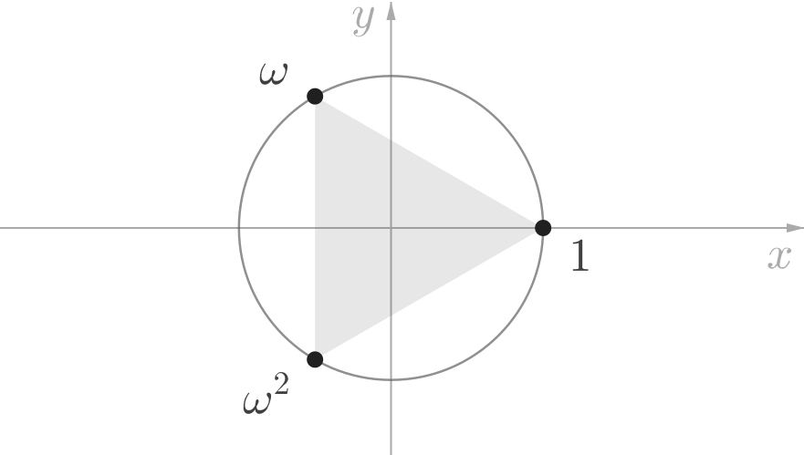

## Introduction

All complex numbers that satisfy the equation $z^3 = 1$ are called the **cube roots of unity**. In this book, we will see how to find the cube roots of unity, and investigate problems that arise from some of their interesting properties.

## Finding the Cube Roots of Unity

To find the cube roots of unity, we need to find all complex numbers, $z,$ such that $z^3 = 1.$ In other words, we need to solve the equation:

$$
z^3 - 1 = 0
$$

Using the well-known factorisation, $a^3 - b^3 = (a-b)(a^2+ab+b^2),$ we can write the above equation as,

$$
(z-1)(z^2 + z + 1) = 0
$$

Factorising the quadratic expression above, we finally have:
$$
\left(z - 1 \right) \left(z -  \frac{-1 + i\sqrt{3}}{2}  \right) \left(z -  \frac{-1 - i\sqrt{3}}{2} \right) = 0
$$

Hence, we see that there are three complex cube roots of unity, of which one is real and the other two are imaginary.
$$
1, \ \left(-\frac{1}{2} + \frac{i\sqrt{3}}{2} \right), \ \left(-\frac{1}{2} - \frac{i\sqrt{3}}{2} \right)  
$$

## Properties of the Cube Roots of Unity

1. The set of all the cube roots of unity is,
$$
\left\{ 1, \ \left(-\frac{1}{2} + \frac{i\sqrt{3}}{2} \right), \ \left(-\frac{1}{2} - \frac{i\sqrt{3}}{2} \right) \right\}
$$

1. If we denote one of the imaginary cube roots of unity by $\omega,$ then the set of all the cube roots of unity can be written as,
$$
\left\{ 1,\ \omega,\ \overline{\omega} \right\}
$$
In other words, each of the imaginary cube roots of unity is the complex conjugate of the other imaginary root.

1. If we denote one of the imaginary cube roots of unity by $\omega,$ then the set of all the cube roots of unity can be written as,
$$
\left\{ 1,\ \omega,\ \omega^2 \right\}
$$
In other words, each of the imaginary cube roots of unity is the square of the other imaginary root.

1. The magnitude of the cube roots of unity is $1.$
$$
\left| \omega \right| \ = \ \left| \omega^2 \right| \ = \ 1
$$

1. The imaginary cube roots of unity are the roots of the equation,
$$
z^2 + z + 1 = 0
$$

1. The sum of all the cube roots of unity is zero.
$$
1 + \omega + \overline{\omega} \ = \ 1 + \omega + \omega^2 \ = \ 0
$$

1. The product of all the cube roots of unity is $1.$
$$
1 \cdot \omega \cdot \overline{\omega} \ = \ 1 \cdot \omega \cdot \omega^2 \ = \ 1
$$

1. If $k$ is any integer, then
$$
\begin{align*}
\omega^{3k} &= 1 \\[1ex]
\omega^{3k + 1} &= \omega \\[1ex]
\omega^{3k + 2} &= \omega^2
\end{align*}
$$

### Note:

From property 1 above, we know the values of all the three cube roots of unity. The other properties are easy to verify using these values. 

---

*<u>Example 1:</u>*

Given that $\alpha$ and $\beta$ are two distinct roots of the equation $x^2 + x + 1 = 0,$ determine the value of
$$
\alpha^4 + \beta^4
$$

<u>*Solution:*</u>

We know that the roots of the equation $x^2 + x + 1$ are the two imaginary cube roots of unity, namely, $\omega$ and $\omega^2.$ We can therefore proceed as follows:
$$
\begin{align*}
\alpha^4 + \beta^4 \ 	&= \ \left( \omega \right)^4 + \left( \omega^2 \right)^4 \\[1ex]
							&= \ \left( \omega^3 \cdot \omega \right) + \left( \omega^{3\cdot 2} \cdot \omega^2 \right) \\[1ex]
							&= \ \omega + \omega^2
\end{align*}
$$
But we know that the sum of all the cube roots of unity is $0.$ That is,
$$
1 + \omega + \omega^2 = 0
$$

Therefore,
$$
\begin{align*}
\alpha^4 + \beta^4 \ 	&= \ \omega + \omega^2 \\[1ex]
											&= \ -1
\end{align*}
$$

---

*<u>Example 2:</u>*

Given that $\omega$ is an imaginary cube root of unity, determine the number of elements in the set,
$$
A = \left\{ \omega^{2n} : n \in \mathbb{N} \right\}
$$
*<u>Solution:</u>*

Every natural number, $n,$ can be written in the form $3k,$ $3k+1,$ $3k+2,$ where $k \in \mathbb{N} \cup \{ 0 \}.$

When $n = 3k,$ we have:
$$
\omega^{2n} = \omega^{6k} = 1
$$

When $n = 3k + 1,$ we have:
$$
\omega^{2n} = \omega^{6k + 2} = \omega^2
$$

When $n = 3k + 2,$ we have:
$$
\omega^{2n} = \omega^{6k + 4} = \omega
$$

So,
$$
A = \left\{ 1, \ \omega, \ \omega^{2} \right\}
$$

Therefore, the set $A$ contains $3$ elements.

---

## Geometrical Interpretation

The trigonometric form of the cube roots of unity allows us to easily plot them on the complex plane. In the next chapter, we will see that this geometric interpretation extends elegantly to the problem of determining the so called, $n$th roots of unity.

### Trigonometric \& Exponential Forms

It's easy to verify that the two imaginary cube roots of unity can be written in trigonometric form as,
$$
\cos \frac{2\pi}{3} \pm i \sin \frac{2\pi}{3}
$$

Similarly, in exponential form, the imaginary cube roots of unity are,
$$
e^{\, \pm \, i(2\pi/3)}
$$

### Cube Roots of Unity on the Complex Plane

From the trigonometric form of the cube roots of unity, we can see that the arguments of the two imaginary cube roots are $\pm\dfrac{2\pi}{3}.$
Also, we already know that the magnitude of each of the cube roots is one.

Hence, we can plot the three cube roots of unity $1,$ $\omega$ and $\omega^2$ on the complex plane as in the following diagram.

It is easy to see that the three cube roots of unity form the vertices of an equilateral triangle.

## n-th Roots of Unity

All complex numbers that satisfy the equation $z^n = 1,$ where $n \in \mathbb{N}$ are called the **$n$th roots of unity**.

The following propositions make it easy to determine the $n$th roots of unity.

* $1$ is an $n$th root of unity.
* The $n$th roots of unity lie on the vertices of a regular $n$-gon inscribed in a unit circle, with centre at the origin of the complex plane.

According to the above propositions, there exist $5$ distinct fifth roots of unity, and they can be represented on the complex plane as follows:

It follows from the above propositions that there exist $n$ distinct $n$th roots of unity, $u_k,$ which can be written in trigonometric form as:
$$
u_k = \cos \left(\frac{2k\pi}{n}\right) + i \sin \left(\frac{2k\pi}{n}\right)
$$
for $k = 0, 1, 2, \ldots (n-1).$

## Practice Problems

1. Let $\omega$ be a non-real cube root of unity. Then determine the value of,
$$
\sum_{k = 1}^{n} \left( k + 1 \right) \left( k\omega + 1 \right) \left( k\omega^2 + 1 \right)
$$
	yb-ans
	$$
	\frac{n^2(n+1)^2}{4} + n.
	$$
	<u>*Hint:*</u> 
	Observe that by expanding and simplifying
	$$
	\left( k + 1 \right) \left( k\omega + 1 \right) \left( k\omega^2 + 1 \right)
	$$
	we get:
	$$
	\omega^3k^3 + \left( \omega^3 + \omega^2 + \omega \right)k^2 + 1
	$$
	Now using the fact that $\omega^3 = 1$ and $1 + \omega + \omega^2 = 0,$ the above expression reduces to $k^3 + 1.$ Hence, the original problem can be re-written as:
	$$
	\sum_{k = 1}^{n} \left( k^3 + 1 \right)
	$$
	which is easy to solve.
	ye-ans

1. Let $\alpha$ be a root of the equation $x^2 + x + 1 = 0$ and the matrix,
$$
A = \frac{1}{\sqrt{3}}
\begin{bmatrix}
1	& 1	&	1 \\
1	& \alpha	&	\alpha^2 \\
1	& \alpha^2	&	\alpha^4 \\
\end{bmatrix}
$$
then the matrix $A^{40}$ is equal to ______.
	yb-ans
	$$
	A^{40} = I =
	\begin{bmatrix}
	1	& 0	&	0 \\
	0	& 1	&	0 \\
	0	&	0	&	1 \\
	\end{bmatrix}
	$$
	<u>*Hint:*</u> 
	Observe that $\alpha$ is a cube root of unity. Therefore, set $\alpha = \omega$ and then compute the value of $A^2$ and $A^4.$ You will find that,
	$$
	A^2 =
	\begin{bmatrix}
	1	& 0	&	0 \\
	0	& 0	&	1 \\
	0	&	1	&	0 \\
	\end{bmatrix}
	$$
	and that $A^4 = A^2 \cdot A^2 = I.$
	ye-ans

1. Given that $\omega$ is an imaginary cube root of unity, determine the number of elements in the set,
$$
A = \left\{ \omega^{9n + 1} : n \in \mathbb{N} \right\}
$$
	yb-ans
	$1.$
	 <u>*Hint:*</u> 
	$\omega^{9n + 1} = \omega^{3(3n) + 1} = \omega^{3m + 1},$ where $m$ is a positive integer. Hence, deduce that $A = \left\{ \omega \right\}.$
	ye-ans

1. Determine all the $n$th roots of unity, when:
	1. $n = 4$
	yb-ans
	$\pm 1,$ $\ \pm i.$
	ye-ans
	1. $n = 6$
	yb-ans
	$\pm 1,$ $\ \left(-\dfrac{1}{2} \pm \dfrac{i\sqrt{3}}{2} \right),$ $\ \left(\dfrac{1}{2} \pm \dfrac{i\sqrt{3}}{2} \right).$
	 <u>*Hint:*</u> 
	Use the formula,
	$$
	u_k = \cos \left(\frac{k\pi}{3}\right) + i \sin \left(\frac{k\pi}{3}\right)
	$$
	for $k = 0, 1, 2, \ldots 5$ to determine the six 6th-roots of unity.
	Alternatively, sketch a unit circle with centre on the Origin of the complex plane. Then inscribe a regular hexagon inside the circle with one vertex at $(1, 0).$ This leads us to the same formula as above.
	ye-ans
