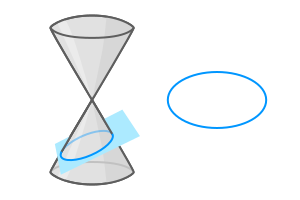
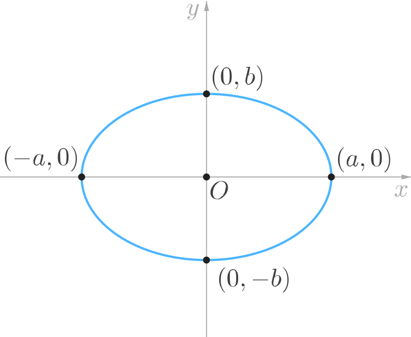
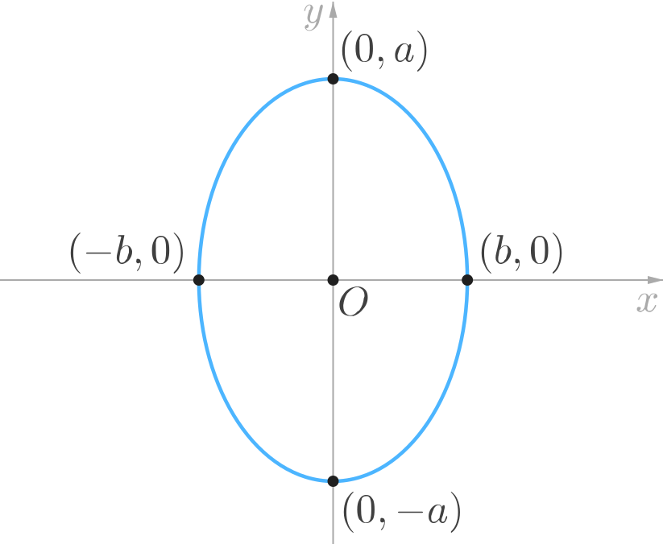
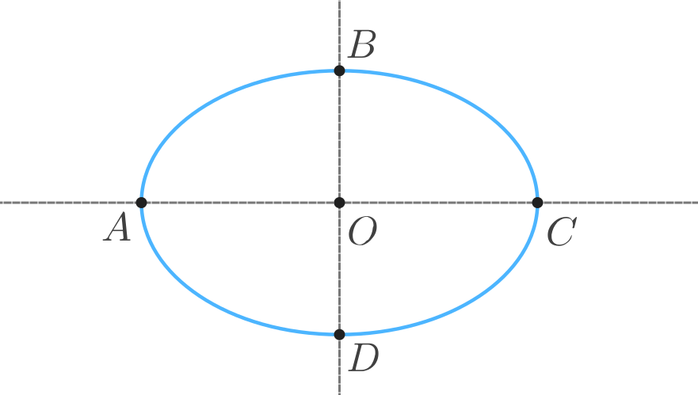
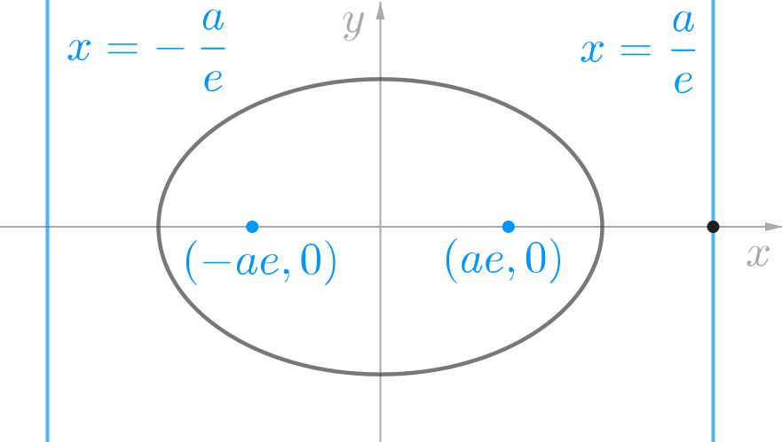
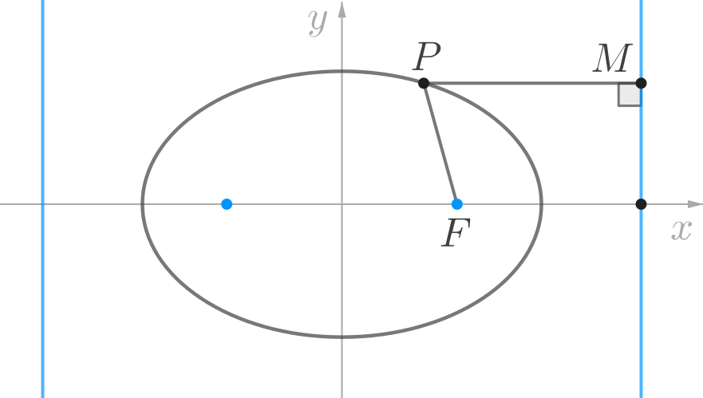
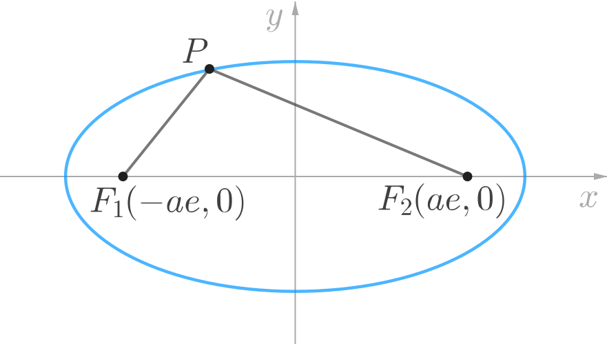
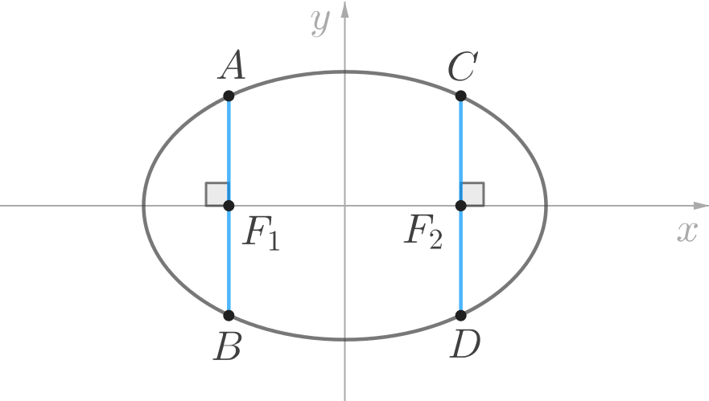

## Introduction

The *circle*, *ellipse*, *hyperbola* and *parabola*  were identified by the ancient Greek geometers as **conic sections**. That is, the shapes that arise when various planes intersect the infinite right-circular cone. In this book, we will study some basic properties of the **ellipse**.

Unlike the ancient geometers, however, we will not define the ellipse as a conic section. Instead, we will work with an alternative algebraic definition of the ellipse so that we can investigate it in the framework of coordinate geometry. This allows us to understand and prove various important properties of the ellipse (and later on, other conic sections) with far less effort than that required by the methods of the ancient Greeks.

<!-- For our study, it is convenient to consider an ellipse with its centre coinciding with the origin of the Cartesian plane, and its axes of symmetry lying along the $x$ and $y$ axes. -->

## Standard Equations of the Ellipse

The plane curve represented by each of the following Cartesian equations is an **ellipse**.

$$
\begin{align*}
\frac{x^2}{a^2} + \frac{y^2}{b^2} &= 1 \\[1ex]
\frac{x^2}{b^2} + \frac{y^2}{a^2} &= 1
\end{align*}
$$

provided that $a \ge b > 0.$ We shall refer to these two equations as the **standard equations** of the ellipse. Observe that the second equation is obtained by interchanging the values of $a$ and $b$ in the first equation.

The first equation can be sketched on the Cartesian plane as follows:

and the second equation can be sketched as follows:

Notice that when $a = b,$ then the ellipse is a circle.

In this book we will only investigate ellipses represented by the standard equations.

## Some Basic Definitions

We shall refer to the following diagram in the definitions stated in this chapter.

**Axes of Symmetry**: 
If the ellipse is not a circle, then the ellipse has exactly **two axes of symmetry**, as shown in the above diagram. The point of intersection, $O$ of the axes of symmetry of the ellipse is called the **centre** of the ellipse.

**Major and Minor Axes**: 
Suppose that axes of symmetry of the ellipse intersect the ellipse at points $A,$ $B,$ $C,$ $D$ as shown in the above diagram. Then the *line segment* with the *greater length* between $AC$ and $BD$ is called the **major axis** of the ellipse. The shorter line segment is called the **minor axis**. In the above diagram, $AC$ is the major axis and $BD$ is the minor axis.

**Vertices of the Ellipse**: 
Each of the *two points* at which the *major axis* intersects the ellipse is called a **vertex** of the ellipse. Each of the *two points* at which the *minor axis* intersects the ellipse is called a **co-vertex** of the ellipse. In the above diagram, $A$ and $C$ are the vertices of the ellipse, while $B$ and $D$ are the co-vertices.

## Properties of the Ellipse

In the following, we will consider the ellipse represented by the following standard equation.
$$
\frac{x^2}{a^2} + \frac{y^2}{b^2} = 1
$$
where $a > b > 0.$

1. The points $(-a, 0)$ and $(a, 0)$ are the vertices of this ellipse.

1. The length of the major axis of the ellipse is $2a$ and the length of its minor axis $2b.$ Hence, the terms $a$ and $b$ that appear in the standard equation of the ellipse are called the lengths of the **semi-major** and **semi-minor** axes respectively.

1. The shape of an ellipse is completely determined by a quantity called its **eccentricity**, $e$ which is defined by the expression:
$$
e = \sqrt{1 - \frac{b^2}{a^2}}
$$
This definition applies to both the standard equations of the ellipse. If we think of the ellipse as a "flattened" circle, then the greater the eccentricity, the more flattened is the ellipse. Observe that according to the above definition, for any ellipse, we always have:
$$
0 \le e < 1
$$
For $e = 0,$ the ellipse is a circle.

1. Each of the two points on the major axis of the ellipse at a distance of $ae$ from the centre of the ellipse is called a **focus** of the ellipse. Each of the two lines, perpendicular to the line containing the major axis of the ellipse and at a distance $\dfrac{a}{e}$ from the centre of the ellipse is called a **directrix** of the ellipse.
For the standard equation given above, the foci are $(\pm ae, 0)$ and the directrices are $x = \pm \dfrac{a}{e}.$

1. We can show that if $P$ is point on the ellipse, then the ratio of the distance of $P$ from one focus, to the perpendicular distance of $P$ from the directrix lying on the same side of the $y$-axis as this focus is constant (equal to $e$).

In terms of the above diagram, we can say that:
$$
\frac{PF}{PM} = e
$$

1. It can also be shown that if $P$ is any point on the ellipse, then the sum of its distances from the two foci, i.e.: $PF_1 + PF_2$ is a constant number (which is equal to $2a$).

1. Sometimes, we will find it convenient to define the coordinates of the foci as $(\pm c, 0).$ Then, according to the definition of the focus stated in point 4 earlier, we have $c = ae.$ The following properties follow from this relationship.
	* We have, $c = \sqrt{a^2 - b^2}.$ Hence, the coordinates of the foci can also be written as $\left( \pm \sqrt{a^2 - b^2}, 0 \right).$
	* The eccentricity can also be defined as the ratio of the distance between the foci ($2c$) to the distance between the vertices ($2a$). That is,
	$$
	e = \dfrac{c}{a}
	$$
	Observe that $c < a$ for an ellipse.

1. A line segment perpendicular to the major axis of the ellipse that passes through a focus of the ellipse and whose end points lie on the ellipse is called a **latus rectum** of the ellipse.

In the above diagram, $AB$ and $CD$ are the latus rectums of the ellipse. The length $l,$ of each latus rectum of the ellipse is:
$$
l = \frac{2b^2}{a}
$$
(This formula applies to both the standard equations of the ellipse).

<!-- 1. Let
$$
c = \sqrt{a^2 - b^2}
$$
Notice that $c < a.$ Each of the two points at a distance $c$ from the centre of the ellipse, and lying on the major axis of the ellipse is called a **focus** of the ellipse. The foci of this ellipse are $F_1(-c, 0)$ and $F_2(c, 0).$ Clearly, the distance between the foci is $2c.$ -->

### Note:

The properties stated in points 5 and 6 above, are both fundamental properties of the ellipse, and each can independently serve as a purely geometric definition of the ellipse. That is to say, a definition that makes no reference to a system of coordinates.

* **Definition-1**: Let there be given a straight line $\delta$ and a point $F$ in a plane. The locus of all points $P$ such that – the ratio of the length $PF,$ to the length of the perpendicular from $P$ on to the line $\delta$ is constant and less than $1$ – is called an ellipse.

* **Definition-2**: Given two points $F_1$ and $F_2$ in a plane, the locus of all points $P$ such that the sum of the lengths $PF_1 + PF_2$ is constant is called an ellipse.

---

*<u>Example 1:</u>*

Determine the coordinates of the foci, the equations of the directrices, the length of the latus rectum, and the eccentricity of the ellipse represented by the equation $3x^2 + 4y^2 = 12.$

<u>*Solution:*</u>

Let us first convert the equation of the ellipse to standard form by dividing the given equation throughout by $12.$
$$
\frac{x^2}{4} + \frac{y^2}{3} = 1
$$
Comparing this with the standard equation, we find that $a^2 = 4$ and $b^2 = 3.$ Observe that since the denominator of $x^2$ is greater than the denominator of $y^2,$ it follows that the major axis (and hence, also the foci) lie on the $x$-axis.

We will first determine the eccentricity.
$$
\begin{align*}
e &= \sqrt{1 - \frac{b^2}{a^2}} \\[1ex]
&= \sqrt{1 - \frac{3}{4}} = \frac{1}{2}
\end{align*}
$$

Using the value of eccentricity , we can easily determine the coordinates of the foci as $(\pm ae, 0),$
$$
(-1, 0 ) \ \text{ and } \ (1, 0 )
$$
and we can determine the equations of the directrices as $x = \pm \dfrac{a}{e},$
$$
x = -4 \ \text{ and } \ x = 4
$$
Finally, we can determine the length of the latus rectum directly using the values of $a$ and $b$ as:
$$
l = \frac{2b^2}{a} = \frac{2(3)}{2} = 3
$$

---

<!-- *<u>Example 2x:</u>*

Given that the distance between the foci of an ellipse is $6,$ and the distance between its directrices is $12,$ then determine the length of the latus rectum of the ellipse.

*<u>Solution:</u>*

Using the properties stated in point 7 above, we note that the distance between the foci of the ellipse is $2ae,$ and the distance between the directrices is $\dfrac{2a}{e}.$ Hence,
$$
2ae = 6 \ \text{ and } \ \dfrac{2a}{e} = 12
$$
Solving the above equations, we find that $a^2 = 18.$ We can now proceed as follows:
$$
\begin{align*}
b^2	&= a^2 - c^2 \\[1ex]
		&= a^2 - a^2e^2 \\[1ex]
		&= 18 - 9 \ = \ 9
\end{align*}
$$
Therefore, the length of the latus rectum is:
$$
l	\ = \ \frac{2b^2}{a} \ = \ \frac{18}{\sqrt{18}}
$$

--- -->

*<u>Example 2:</u>*

Given that the distance between the foci of an ellipse is $2c,$ and the distance between its directrices is $2d,$ then determine the length of the latus rectum of the ellipse in terms of $c$ and $d.$

*<u>Solution:</u>*

From the definition of the focus and directrix stated in point 4 earlier, we note that the distance between the foci of the ellipse is $2ae,$ and the distance between the directrices is $\dfrac{2a}{e}.$ Hence,
$$
2ae = 2c \ \text{ and } \ \dfrac{2a}{e} = 2d
$$
Solving the above equations, we find that $a^2 = c d.$ We can now proceed as follows:
$$
\begin{align*}
b^2	&= a^2 - c^2 \\[1ex]
		&= cd - c^2
\end{align*}
$$
Therefore, the length of the latus rectum is:
$$
l	\ = \ \frac{2b^2}{a} \ = \ \frac{2\left(c d - c^2 \right)}{\sqrt{cd}}
$$

---

*<u>Example 3:</u>*

Determine the vertices, the foci and the directrices of the ellipse given by:
$$
\frac{x^2}{b^2} + \frac{y^2}{a^2} = 1
$$
where $a > b > 0.$

*<u>Solution:</u>*

In this case, since the denominator of $y^2$ is greater than the denominator of $x^2,$ it follows that the major axis of this ellipse (and hence, the vertices and the foci) lie on the $y$-axis.

The points at which the major axis intersects the ellipse are the vertices:
$$
(0, -a) \ \text{ and } \ (0, a)
$$
Hence, the foci of this ellipse are:
$$
\left(0, -\sqrt{a^2 - b^2} \right) \ \text{ and } \ \left(0, \sqrt{a^2 - b^2} \right)
$$
and the directrices are:
$$
y = \dfrac{-a^2}{\sqrt{a^2 - b^2}} \ \text{ and } \ y = \dfrac{a^2}{\sqrt{a^2 - b^2}}.
$$

---

## Tangent to the Ellipse

We will consider the problem of finding the tangent to an ellipse, given a point $(x_0, y_0)$ on the ellipse.

**Tangent at the point $(x_0, y_0)$**

Of course, we can find the equation of the tangent in the usual way by first determining its slope as the derivative of $y$ at $(x_0, y_0),$ and then using the point-slope form of the equation of a line.

However, the result is easy to remember in the following form.

| Ellipse	| Tangent	|
|			:----------:		|			:----------:		|
| $\dfrac{x^2}{a^2} + \dfrac{y^2}{b^2} = 1$	| $\dfrac{x_0 x}{a^2} + \dfrac{y_0 y}{b^2} = 1$ |
| $\dfrac{x^2}{b^2} + \dfrac{y^2}{a^2} = 1$	| $\dfrac{x_0 x}{b^2} + \dfrac{y_0 y}{a^2} = 1$ |

In general, the equation of the tangent to an ellipse, hyperbola or parabola at the point $(x_0, y_0)$ can be obtained from the corresponding standard equation by replacing:

* any $x^2$ term by $x_0 x$
* any $y^2$ term by $y_0 y$
* any $2x$ term by $(x + x_0)$
* any $2y$ term by $(y + y_0)$

 **Condition for Tangency**

We can prove that a line $y = mx + c$ will be tangent to an ellipse if the following condition is satisfied.

| Ellipse	| Condition	|
|			:----------:		|			:----------:		|
| $\dfrac{x^2}{a^2} + \dfrac{y^2}{b^2} = 1$	| $c^2 = a^2 m^2 + b^2$ |
| $\dfrac{x^2}{b^2} + \dfrac{y^2}{a^2} = 1$	| $c^2 = b^2 m^2 + a^2$ |

Note that the variable $c$ used here is <u>not</u> related to the coordinates of the focus of the ellipse. Instead, it represents the $y$ intercept of the line $y = mx + c.$

<!-- Let there be given an ellipse whose equation is,
$$
\frac{x^2}{a^2} + \frac{y^2}{b^2} = 1.
$$
then:

1. The equation of the tangent to the ellipse at a point $P\, (x_0, y_0)$ lying on the ellipse is,
$$
\frac{x_0 x}{a^2} + \frac{y_0 y}{b^2} = 1
$$

1. The condition for the line $y = mx + c$ to be tangent to this ellipse is,
$$
c = \pm \sqrt{a^2m^2 + b^2}
$$
(The variable $c$ used here is <u>not</u> related to the coordinates of the focus of the ellipse.) -->

---

*<u>Example 4:</u>*

Determine the equation of the normal to the ellipse,
$$
\frac{x^2}{16} + \frac{y^2}{4} = 1
$$
at the point $\left( 2, \sqrt{3}\right).$

*<u>Solution:</u>*

The equation of the tangent at the point $\left( 2, \sqrt{3}\right)$ is,
$$
\frac{2 x}{16} + \frac{\sqrt{3} y}{4} = 1.
$$
That is,
$$
y = \frac{-1}{2\sqrt{3}} x + \frac{4}{\sqrt{3}}
$$
Hence the slope of the normal to this line is $2\sqrt{3}.$ Therefore, the equation of the normal at the point $\left( 2, \sqrt{3}\right)$ is,
$$
y - \sqrt{3} \ = \ 2\sqrt{3} \, (x - 2)
$$
Which is:
$$
2\sqrt{3} x - y = 3\sqrt{3}.
$$

---

## Practice Problems

1. Determine the coordinates of the foci, the equations of the directrices, the length of the latus rectum, and the eccentricity of an ellipse represented by each of the following equations:
 	1.	$2x^2 + 9y^2 = 18$
		yb-ans
		Foci: $\left( \pm \sqrt{7}, 0 \right),$ directrices: $x = \pm \dfrac{9}{\sqrt{7}},$ length of latus rectum: $\dfrac{4}{3},$ eccentricity: $\dfrac{\sqrt{7}}{3}.$
		 <u>*Hint:*</u> 
		Convert the equation to standard form:
		$$
		\frac{x^2}{9} + \frac{y^2}{2} = 1
		$$
		and observe that the denominator of $x^2$ is greater than the denominator of $y^2.$ Hence, the major axis lies along the $x$-axis. Now, using $a = 3$ and $b = \sqrt{2},$ determine the eccentricity $e$ and the length of the latus rectum $l.$ Then, use $e$ to determine the foci and directrices.
		ye-ans
	1.	$4x^2 + y^2 = 4$
		yb-ans
		Foci: $\left( 0, \pm \sqrt{3} \right),$ directrices: $y = \pm \dfrac{4}{\sqrt{3}},$ length of latus rectum: $1,$ eccentricity: $\dfrac{\sqrt{3}}{2}.$
		 <u>*Hint:*</u> 
		Convert the equation to standard form:
		$$
		\frac{x^2}{1} + \frac{y^2}{4} = 1
		$$
		and observe that the denominator of $y^2$ is greater than the denominator of $x^2.$ Hence, the major axis lies along the $y$-axis. Now, using $a = 2$ and $b = 1,$ determine the eccentricity $e$ and the length of the latus rectum $l.$ Then, use $e$ to determine the foci and directrices.
		ye-ans

1. The eccentricity of an ellipse is $\dfrac{1}{3}.$ Determine the ratio of the length of its latus rectum to the length of its:
 	1.	major axis
		yb-ans
		The ratio is $8:9.$
		 <u>*Hint:*</u> 
		The length of the latus rectum is $\dfrac{2b^2}{a},$ and the length of the major axis is $2a.$ Hence, the required ratio is,
		$$
		\dfrac{2b^2}{a} \div 2a = \dfrac{b^2}{a^2}
		$$
		But, given that the eccentricity $e = \dfrac{1}{3},$ it follows that,
		$$
		\dfrac{1}{3} = \sqrt{1 - \frac{b^2}{a^2}}
		$$
		Use this equation to determine the value of $\dfrac{b^2}{a^2}.$
		ye-ans

	1.	minor axis
		yb-ans
		The ratio is $2\sqrt{2}:3.$
		 <u>*Hint:*</u> 
		The length of the latus rectum is $\dfrac{2b^2}{a},$ and the length of the minor axis is $2b.$ Hence, the required ratio is,
		$$
		\dfrac{2b^2}{a} \div 2b = \dfrac{b}{a}
		$$
		But, given that the eccentricity $e = \dfrac{1}{3},$ it follows that,
		$$
		\dfrac{1}{3} = \sqrt{1 - \frac{b^2}{a^2}}
		$$
		Use this equation to determine the value of $\dfrac{b}{a}.$
		(Observe that this ratio is simply the square root of the ratio obtained in the first part of the problem.)
		ye-ans

1. The distance between the foci of an ellipse is $4,$ and the length of its latus rectum is $6.$ Determine the eccentricity of the ellipse.
	yb-ans
	$\dfrac{1}{2}.$
	 <u>*Hint:*</u> 
	Given that $\dfrac{2b^2}{a} = 6,$ it follows that:
	$$
	\dfrac{b^2}{a^2} = \dfrac{3}{a}
	$$
	But, since we know that $e = \sqrt{1 - \frac{b^2}{a^2}},$ it follows that,
	$$
	e^2 = 1 - \dfrac{3}{a}
	$$
	Also, given that $2ae = 4,$ it follows that $a = \dfrac{2}{e}.$ Substituting this in the previous equation, we get,
	$$
	e^2 = 1 - \dfrac{3e}{2}
	$$
	Multiply the above equation with $2,$ then re-arrange to obtain,
	$$
	2e^2 + 3e - 2 = 0
	$$
	Now solve the above quadratic equation and select the value that satisfies $0 \le e < 1.$
	ye-ans

1. Determine the equations of the tangent and normal to the ellipse,
$$
\frac{x^2}{9} + \frac{y^2}{12} = 1
$$
at the point $\left( \sqrt{6}, -2 \right).$
	yb-ans
	Equation of tangent is,
	$$
	2\sqrt{6}x - 3y = 18
	$$
	and equation of normal is,
	$$
	\sqrt{6}x + 4y = -2.
	$$
	<u>*Hint:*</u> 
	Using the formula for the equation of tangent to an ellipse, we get,
	$$
	\dfrac{\sqrt{6}x}{9} - \dfrac{2y}{12} = 1
	$$
	Determine the slope of the tangent above, and use it to determine the slope of the normal. Then determine the equation of the normal using the point-slope form of the equation of a straight line.
	ye-ans

1. If $\sqrt{2}x - y = \sqrt{20}$ is tangent to the ellipse
$$
\frac{x^2}{a^2} + \frac{y^2}{4} = 1
$$
for some $a > 2,$ then determine the coordinates of the foci of the ellipse.
	yb-ans
	Coordinates of the foci: $(\pm 2, 0).$
	 <u>*Hint:*</u> 
	The equation of the tangent is $y = \sqrt{2}x - \sqrt{20}.$ Recall that the condition for $y = mx + c$ to be tangent to,
	$$
	\frac{x^2}{a^2} + \frac{y^2}{b^2} = 1
	$$
	is $c^2 = a^2m^2 + b^2.$ So, in this case, we have:
	$$
	20 = 2a^2 + 4
	$$
	Hence, $a = \sqrt{8}.$ We know that the coordinates of the foci are $\left( \pm \sqrt{a^2 - b^2}, 0 \right).$
	ye-ans

1. Let there be given a circle whose centre coincides with the origin of the Cartesian plane, and whose radius is $a$ units. Suppose that the ordinate of every point on the circle is multiplied by a factor of $k$ (where $0 < k < 1$), while keeping the corresponding abscissa unchanged. Then prove that the new curve so obtained is an ellipse. Determine the eccentricity of this ellipse.
	yb-ans
	Eccentricity of the ellipse is $\sqrt{1-k^2}.$
	 <u>*Hint:*</u> 
	Suppose that the point $P\left( x, y \right)$ is a point on the <u>new</u> curve. According to the statement of the problem, the ordinate ($y$-coordinate) of this point was obtained by multiplying the ordinate of a point on the original circle with $k.$ Hence, if $P(x, y)$ lies on the new curve, then it follows that the point $Q\left( x, \dfrac{y}{k} \right)$ lies on the original circle whose radius is $a$ and centre coincides with the origin.
	Therefore, the coordinates of $Q$ must satisfy the equation of a circle. That is,
	$$
	x^2 + \left(\dfrac{y}{k}\right)^2 = a^2
	$$
	Dividing throughout by $a^2,$ we get:
	$$
	\dfrac{x^2}{a^2} + \dfrac{y^2}{(ka)^2} = 1
	$$
	Given that $0 < k < 1,$ it follows that $ka < a$ and therefore we have obtained the equation of an ellipse in standard form, where $b = ka.$ Hence, the new curve is an ellipse whose centre lies on the origin and whose major axis lies along the $x$-axis. Now, determine the eccentricity of this ellipse.
	ye-ans
