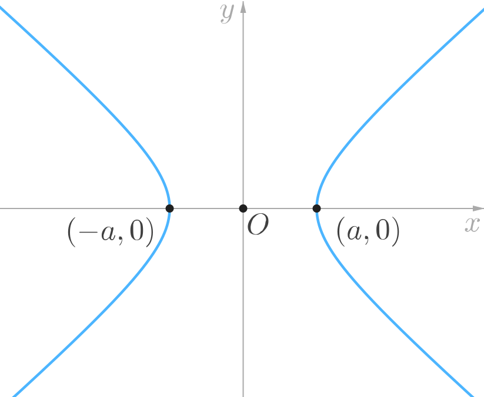
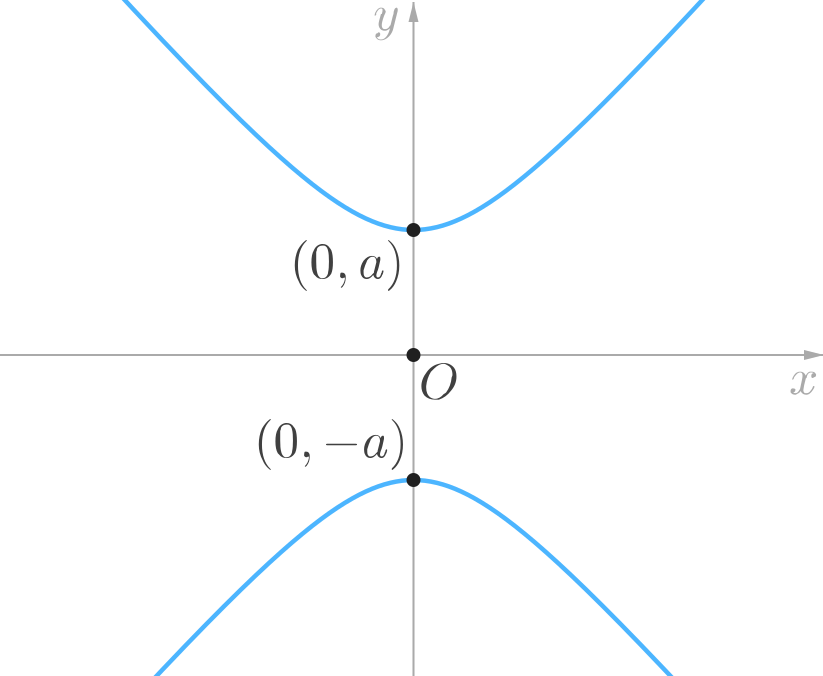
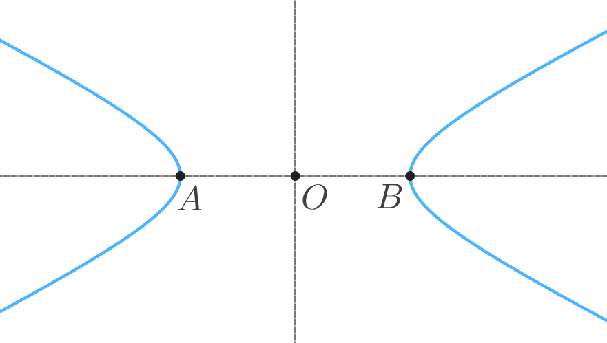

## Introduction

Recall from the previous book – *Ellipse* – that the circle, ellipse, hyperbola and parabola were identified by ancient geometers as **conic sections**. In this book, we will move on to the next conic section and study some basic properties of the **hyperbola**.

As before, we will once again work with an alternative algebraic definition of the hyperbola so that we can investigate it in the framework of coordinate geometry. We will find many striking similarities between the properties of the ellipse and of the hyperbola.

## Standard Equations of the Hyperbola

The plane curve represented by each of the following Cartesian equations is a hyperbola.

$$
\begin{align*}
\frac{x^2}{a^2} - \frac{y^2}{b^2} &= 1 \\[1ex]
\frac{y^2}{a^2} - \frac{x^2}{b^2} &= 1
\end{align*}
$$

By convention, we will assume that $a$ and $b$ are positive. We shall refer to these two equations as the **standard equations** of the hyperbola. Observe that the second equation is obtained by interchanging the values of $x$ and $y$ in the first equation.

The first equation can be sketched on the Cartesian plane as follows:

and the second equation can be sketched as follows:

<!-- When $a = b,$ then the hyperbola is said to be **equilateral**. We will revisit this in the last chapter. -->

In this book we will only investigate hyperbolas represented by the standard equations.

## Some Basic Definitions

We shall refer to the following diagram in the definitions stated in this chapter.

**Axes of Symmetry**: 
The hyperbola has exactly two **axes of symmetry**, as shown in the above diagram. The point of intersection, $O$ of the axes of symmetry of the hyperbola is called the **centre** of the hyperbola.

**Vertices & Transverse Axis**: 
Only one of the two axes of symmetry of the hyperbola intersects the hyperbola. Each of the two points at which this axis of symmetry intersects the hyperbola is called a **vertex** of the hyperbola. The line segment joining the vertices is called the **transverse axis** of the hyperbola. In the above diagram, the vertices are marked as points $A$ and $B,$ and hence the transverse axis is $AB.$

## Properties of the Hyperbola

In the following, we will consider the hyperbola represented by the following standard equation.
$$
\frac{x^2}{a^2} - \frac{y^2}{b^2} = 1
$$
where $a$ and $b$ are both positive. We will observe that each of the following properties of a hyperbola corresponds to a similar property related to the ellipse. Some properties are exactly the same, others are analogous, but differ in particular details.

1. The points $(-a, 0)$ and $(a, 0)$ are the vertices of this hyperbola.

1. The length of the transverse axis of the hyperbola is $2a.$ Hence, the term $a$ that appears in the standard equation of the hyperbola is called the length of its **semi-transverse axis**.

1. The shape of a hyperbola is completely determined by a quantity called its **eccentricity**, $e$ which is defined by the expression:
$$
e = \sqrt{1 + \frac{b^2}{a^2}}
$$
This definition applies to both the standard equations of the hyperbola. Observe that according to the above definition, for any hyperbola, we always have:
$$
e > 1
$$
For $e = \sqrt{2},$ we obtain the so called **equilateral hyperbola**. <!-- We will revisit this concept in the last chapter. -->

1. Each of the two points on the line containing the transverse axis of the hyperbola, at a distance of $ae$ from the centre of the hyperbola, is called a **focus** of the hyperbola. Each of the two lines, perpendicular to the line containing the transverse axis of the hyperbola, and at a distance $\dfrac{a}{e}$ from the centre of the hyperbola, is called a **directrix** of the hyperbola.
For the standard equation given above, the foci are $(\pm ae, 0)$ and the directrices are $x = \pm \dfrac{a}{e}.$

1. We can show that if $P$ is a point on the hyperbola, then the ratio of the distance of $P$ from one focus, to the perpendicular distance of $P$ from the directrix lying on the same side of the $y$-axis as this focus is constant (equal to $e$).

In terms of the above diagram, we can say that:
$$
\frac{PF}{PM} = e
$$

1. It can also be shown that if $P$ is any point on the hyperbola, then the absolute value of the difference of its distances from the two foci, i.e.: $\left| PF_1 - PF_2 \right|$ is a constant number (which is equal to $2a$).

1. Sometimes, we will find it convenient to define the coordinates of the foci as $(\pm c, 0).$ Then, according to the definition of the focus stated in point 4 earlier, we have $c = ae.$ The following properties follow from this relationship.

	* We have, $c = \sqrt{a^2 + b^2}.$ Hence, the coordinates of the foci can also be written as $\left( \pm \sqrt{a^2 + b^2}, 0 \right).$
	* The eccentricity can also be defined as the ratio of the distance between the foci ($2c$) to the distance between the vertices ($2a$). That is,
	$$
	e = \dfrac{c}{a}
	$$
	Observe that $c > a$ for a hyperbola.

1. A line segment perpendicular to the transverse axis of the hyperbola that passes through a focus of the hyperbola and whose end points lie on the hyperbola is called a **latus rectum** of the hyperbola.

In the above diagram, $AB$ and $CD$ are the latus rectums of the hyperbola. The length $l,$ of each latus rectum of the hyperbola is:
$$
l = \frac{2b^2}{a}
$$
(This formula applies to both the standard equations of the hyperbola.)

### Note:

The properties stated in points 5 and 6 above, are both fundamental properties of the hyperbola, and each can independently serve as a purely geometric definition of the hyperbola. That is to say, a definition that makes no reference to a system of coordinates.

* **Definition-1**: Let there be given a straight line $\delta$ and a point $F$ in a plane. The locus of all points $P$ such that – the ratio of the length $PF,$ to the length of the perpendicular from $P$ on to the line $\delta$ is constant and greater than $1$ – is called a hyperbola.

* **Definition-2**: Given two points $F_1$ and $F_2$ in a plane, the locus of all points $P$ such that absolute value of the difference of the lengths $\left| PF_1 - PF_2 \right| $ is constant is called a hyperbola.

---

*<u>Example 1:</u>*

Determine the coordinates of the foci, the equations of the directrices, the length of the latus rectum, and the eccentricity of the hyperbola represented by the equation $7x^2 - 9y^2 = 63.$

<u>*Solution:*</u>

Let us first convert the equation of the hyperbola to standard form by dividing the given equation throughout by $63.$
$$
\frac{x^2}{9} - \frac{y^2}{7} = 1
$$
Comparing this with the standard equation, we find that $a^2 = 9$ and $b^2 = 7.$ Observe that since the $x^2$ term is positive, it follows that the foci lie on the $x$-axis.

We will first determine the eccentricity.
$$
\begin{align*}
e &= \sqrt{1 + \frac{b^2}{a^2}} \\[1ex]
&= \sqrt{1 + \frac{7}{9}} = \frac{4}{3}
\end{align*}
$$

Using the value of eccentricity , we can easily determine the coordinates of the foci as $(\pm ae, 0),$
$$
(-4, 0 ) \ \text{ and } \ (4, 0 )
$$
and we can determine the equations of the directrices as $x = \pm \dfrac{a}{e},$
$$
x = -\dfrac{9}{4} \ \text{ and } \ x = \dfrac{9}{4}
$$
Finally, we can determine the length of the latus rectum directly using the values of $a$ and $b$ as:
$$
l = \frac{2b^2}{a} = \frac{2(7)}{3} = \dfrac{14}{3}
$$

---

*<u>Example 2:</u>*

The foci of a hyperbola are located at the points $(0, \pm 2),$ and the length of its latus rectum is $6.$ Determine the equation of this hyperbola.

<u>*Solution:*</u>

First observe, that the foci of the given hyperbola are symmetric with respect to the origin and lie on the $y$-axis. Therefore, we will write the standard equation of the required hyperbola as,
$$
\frac{y^2}{a^2} - \frac{x^2}{b^2} = 1
$$  
We will now determine the values of $a$ and $b.$ We know that $c^2 = a^2 + b^2,$ and $l = \dfrac{2b^2}{a},$ where $c$ is the distance of the focus from the origin, and $l$ is the length of the latus rectum of the hyperbola. Based on the given information we get,
$$
\begin{align*}
a^2 + b^2 &= 4 \\[1ex]
\dfrac{2b^2}{a} &= 6
\end{align*}
$$
From the second equation, we find that $b^2 = 3a.$ Substituting this in the first equation, we get a quadratic equation in $a.$
$$
a^2 + 3a - 4 = 0
$$
Solving and selecting the positive value of $a,$ we get $a = 1.$ Hence, we find that $b = \sqrt{3}.$ Therefore, the required equation of the hyperbola is:
$$
\dfrac{y^2}{1} - \dfrac{x^2}{3} = 1
$$
Of course, we may also write this as, $3y^2 - x^2 = 3.$

---

<!-- *<u>Example 2x:</u>*

Given that the distance between the foci of an ellipse is $6,$ and the distance between its directrices is $12,$ then determine the length of the latus rectum of the ellipse.

*<u>Solution:</u>*

Using the properties stated in point 7 above, we note that the distance between the foci of the ellipse is $2ae,$ and the distance between the directrices is $\dfrac{2a}{e}.$ Hence,
$$
2ae = 6 \ \text{ and } \ \dfrac{2a}{e} = 12
$$
Solving the above equations, we find that $a^2 = 18.$ We can now proceed as follows:
$$
\begin{align*}
b^2	&= a^2 - c^2 \\[1ex]
		&= a^2 - a^2e^2 \\[1ex]
		&= 18 - 9 \ = \ 9
\end{align*}
$$
Therefore, the length of the latus rectum is:
$$
l	\ = \ \frac{2b^2}{a} \ = \ \frac{18}{\sqrt{18}}
$$

--- -->

<!-- *<u>Example 2:</u>*

Given that the distance between the foci of a hyperbola is $2c,$ and the distance between its directrices is $2d,$ then determine the length of the latus rectum of the hyperbola.

*<u>Solution:</u>*

Using the properties stated in point 7 above, we note that the distance between the foci of the hyperbola is $2ae,$ and the distance between the directrices is $\dfrac{2a}{e}.$ Hence,
$$
2ae = 2c \ \text{ and } \ \dfrac{2a}{e} = 2d
$$
Solving the above equations, we find that $a^2 = c d.$ We can now proceed as follows:
$$
\begin{align*}
b^2	&= c^2 - a^2 \\[1ex]
		&= c^2 - cd
\end{align*}
$$
Therefore, the length of the latus rectum is:
$$
l	\ = \ \frac{2b^2}{a} \ = \ \frac{2\left( c^2 - cd \right)}{\sqrt{cd}}
$$

--- -->

*<u>Example 3:</u>*

Determine the vertices, the foci and the directrices of the hyperbola given by:
$$
\frac{y^2}{a^2} - \frac{x^2}{b^2} = 1
$$
where $a,$ and $b$ are positive.

*<u>Solution:</u>*

In this case, since the $y^2$ term is positive, it follows that the transverse axis of this hyperbola (and hence, the vertices and the foci) lie on the $y$-axis.

The points at which the transverse axis intersects the hyperbola are the vertices:
$$
(0, -a) \ \text{ and } \ (0, a)
$$
Hence, the foci of this hyperbola are:
$$
\left(0, -\sqrt{a^2 + b^2} \right) \ \text{ and } \ \left(0, \sqrt{a^2 + b^2} \right)
$$
and the directrices are:
$$
y = \dfrac{-a^2}{\sqrt{a^2 + b^2}} \ \text{ and } \ y = \dfrac{a^2}{\sqrt{a^2 + b^2}}.
$$

---

## Tangent to the Hyperbola

We will consider the problem of finding the tangent to a hyperbola at a point $(x_0, y_0)$ on the hyperbola.

**Tangent at the point $(x_0, y_0)$**

We can find the equation of the tangent in the usual way by first determining its slope as the derivative of $y$ at $(x_0, y_0),$ and then using the point-slope form of the equation of a line.

The result is easy to remember in the following form.

| Hyperbola	| Tangent	|
|			:----------:		|			:----------:		|
| $\dfrac{x^2}{a^2} - \dfrac{y^2}{b^2} = 1$	| $\dfrac{x_0 x}{a^2} - \dfrac{y_0 y}{b^2} = 1$ |
| $\dfrac{y^2}{a^2} - \dfrac{x^2}{b^2} = 1$	| $\dfrac{y_0 y}{a^2} - \dfrac{x_0 x}{b^2} = 1$ |

In general, the equation of the tangent to a hyperbola, ellipse or parabola at the point $(x_0, y_0)$ can be obtained from the corresponding standard equation by replacing:

* any $x^2$ term by $x_0 x$
* any $y^2$ term by $y_0 y$
* any $2x$ term by $(x + x_0)$
* any $2y$ term by $(y + y_0)$

 **Condition for Tangency**

We can prove that a line $y = mx + c$ will be tangent to a hyperbola if the following condition is satisfied.

| Hyperbola	| Condition	|
|			:----------:		|			:----------:		|
| $\dfrac{x^2}{a^2} - \dfrac{y^2}{b^2} = 1$	| $c^2 = a^2 m^2 - b^2$ |
| $\dfrac{y^2}{a^2} - \dfrac{x^2}{b^2} = 1$	| $c^2 = a^2 - b^2 m^2$ |

Note that the variable $c$ used here is <u>not</u> related to the coordinates of the focus of the hyperbola. Instead, it represents the $y$-intercept of the line $y = mx + c.$

<!-- Let there be given a hyperbola whose equation is,
$$
\frac{x^2}{a^2} - \frac{y^2}{b^2} = 1.
$$
then:

1. The equation of the tangent to the hyperbola at a point $P\, (x_0, y_0)$ lying on the hyperbola is,
$$
\frac{x_0 x}{a^2} - \frac{y_0 y}{b^2} = 1
$$

1. The condition for the line $y = mx + c$ to be tangent to this hyperbola is,
$$
c = \pm \sqrt{a^2m^2 - b^2}
$$
(The value $c$ used here is not related to the coordinates of the focus of the hyperbola.) -->

---

*<u>Example 4:</u>*

Determine the equation of the normal to the hyperbola,
$$
\frac{x^2}{4} - \frac{y^2}{36} = 1
$$
at the point $\left( -\sqrt{5}, 3 \right).$

*<u>Solution:</u>*

The equation of the tangent at the point $\left( -\sqrt{5}, 3 \right)$ is,
$$
\frac{-\sqrt{5} x}{4} - \frac{3y}{36} = 1.
$$
That is,
$$
y = -3\sqrt{5} x - 12
$$
Hence the slope of the normal to this line is $\dfrac{1}{3\sqrt{5}}.$ Therefore, the equation of the normal at the point $\left( -\sqrt{5}, 3 \right)$ is,
$$
y - 3 \ = \ \dfrac{1}{3\sqrt{5}} \, (x + \sqrt{5})
$$
Which is:
$$
x - 3\sqrt{5} y = -10\sqrt{5}.
$$

---

## Practice Problems

1. Determine the coordinates of the foci, the equations of the directrices, the length of the latus rectum, and the eccentricity of a hyperbola represented by each of the following equations:
 	1.	$26x^2 - 10y^2 = 260$
		yb-ans
		Foci: $\left( \pm 6, 0 \right),$ directrices: $x = \pm \dfrac{5}{3},$ length of latus rectum: $\dfrac{52}{\sqrt{10}},$ eccentricity: $\dfrac{6}{\sqrt{10}}.$
		 <u>*Hint:*</u> 
		Convert the equation to standard form:
		$$
		\frac{x^2}{10} - \frac{y^2}{26} = 1
		$$
		and observe that the $x^2$ term is positive. Hence, the transverse axis lies along the $x$-axis. Now, using $a = \sqrt{10}$ and $b = \sqrt{26},$ determine the coordinates of the foci $(\pm c, 0),$ where $c = \sqrt{a^2 + b^2}$ and also determine the length of the latus rectum $l.$ Now, determine the eccentricity $e = \dfrac{c}{a}.$  Then, use $a$ and $e$ to determine the directrices.
		ye-ans
	1.	$9x^2 - 16y^2 = -144$
		yb-ans
		Foci: $\left( 0, \pm 5 \right),$ directrices: $y = \pm \dfrac{9}{5},$ length of latus rectum: $\dfrac{32}{3},$ eccentricity: $\dfrac{5}{3}.$
		 <u>*Hint:*</u> 
		Divide throughout by $-144$ and rearrange the terms to convert the equation to standard form:
		$$
		\frac{y^2}{9} - \frac{x^2}{16} = 1
		$$
		Now observe that the $y^2$ term is positive. Hence, the transverse axis lies along the $y$-axis. Now, using $a = 3$ and $b = 4,$ determine the coordinates of the foci $(0, \pm c),$ where $c = \sqrt{a^2 + b^2}$ and also the length of the latus rectum $l.$ Now, determine the eccentricity $e = \dfrac{c}{a}.$  Then, use $a$ and $e$ to determine the directrices.
		ye-ans

1. The eccentricity of an hyperbola is $2.$ Determine the ratio of the length of its latus rectum to the length of its transverse axis.
	yb-ans
	The ratio is $3 : 1.$
	 <u>*Hint:*</u> 
	The length of the latus rectum is $\dfrac{2b^2}{a},$ and the length of the transverse axis is $2a.$ Hence, the required ratio is,
	$$
	\dfrac{2b^2}{a} \div 2a = \dfrac{b^2}{a^2}
	$$
	But, given that the eccentricity $e = 2,$ it follows that,
	$$
	2 = \sqrt{1 + \frac{b^2}{a^2}}
	$$
	Use this equation to determine the value of $\dfrac{b^2}{a^2}.$
	ye-ans

1. The foci of a hyperbola are located at the points $(\pm 1, 0),$ and the length of its latus rectum is $3.$ Determine the equation of this hyperbola. Also determine its eccentricity.
	yb-ans
	Equation of hyperbola is $12x^2 - 4y^2 = 3,$ eccentricity is $2.$
	 <u>*Hint:*</u> 
	Proceed as in Example-2. However, this time observe that since the foci of the given hyperbola are symmetric with respect to the origin and lie on the $x$-axis. Therefore, the form of the standard equation of the required hyperbola is,
	$$
	\frac{x^2}{a^2} - \frac{y^2}{b^2} = 1
	$$  
	ye-ans

1. Determine the equations of the tangent and normal to the hyperbola,
$$
\frac{y^2}{3} - \frac{x^2}{6} = 1
$$
at the point $\left( -\sqrt{2}, 2 \right).$
	yb-ans
	Equation of tangent is,
	$$
	\sqrt{2}x + 4y = 6
	$$
	and equation of normal is,
	$$
	2\sqrt{2}x - y = -6
	$$
	<u>*Hint:*</u> 
	Using the formula for the equation of the tangent to a hyperbola, we get,
	$$
	\dfrac{2y}{3} - \dfrac{\sqrt{2}x}{6} = 1
	$$
	Determine the slope of the tangent above, and use it to determine the slope of the normal. Then determine the equation of the normal using the point-slope form of the equation of a straight line.
	ye-ans

1. If $2x - y + 3 = 0$ is tangent to the hyperbola
$$
\frac{x^2}{a^2} - \frac{y^2}{7} = 1
$$
then determine the coordinates of the foci of the hyperbola.
	yb-ans
	Coordinates of the foci: $\left( \pm \sqrt{11}, 0 \right).$
	 <u>*Hint:*</u> 
	Equation of the tangent is $y = 2x + 3.$ Recall that the condition for $y = mx + c$ to be tangent to,
	$$
	\frac{x^2}{a^2} - \frac{y^2}{b^2} = 1
	$$
	is $c^2 = a^2m^2 - b^2.$ So, in this case, we have:
	$$
	9 = 4a^2 - 7
	$$
	Hence, $a = 2.$ We know that the coordinates of the foci are $\left( \pm \sqrt{a^2 + b^2}, 0 \right).$
	ye-ans

1. The transverse axis of a hyperbola lies along the $y$-axis and its centre coincides with the origin of the Cartesian plane. Further it is know that the distances of one of its vertices from the foci are equal to $1$ and $9$ respectively. Determine the equation of this hyperbola.
	yb-ans
	$\dfrac{y^2}{16} - \dfrac{x^2}{9} = 1.$
	 <u>*Hint:*</u> 
	Given that the transverse axis lies along the $y$-axis and is symmetric about the origin, we know that the required equation of the hyperbola has the form,
	$$
	\frac{y^2}{a^2} - \frac{x^2}{b^2} = 1
	$$
	The vertices and foci of a hyperbola always lie along a straight line (containing the transverse axis), hence if the distances of a vertex from the two foci are $1$ and $9,$ then it follows that the distance between foci is $2c = 10.$ Furthermore, since the distance of one of the vertices from one of the foci is $1,$ because of symmetry, the distance between the vertices will be $2a = 8.$ This is easy to see if you sketch one vertex and the given foci on the $y$-axis. Using the values of $c$ and $a,$ we can now determine the equation of the hyperbola.
	ye-ans
