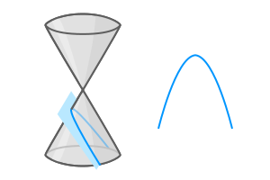
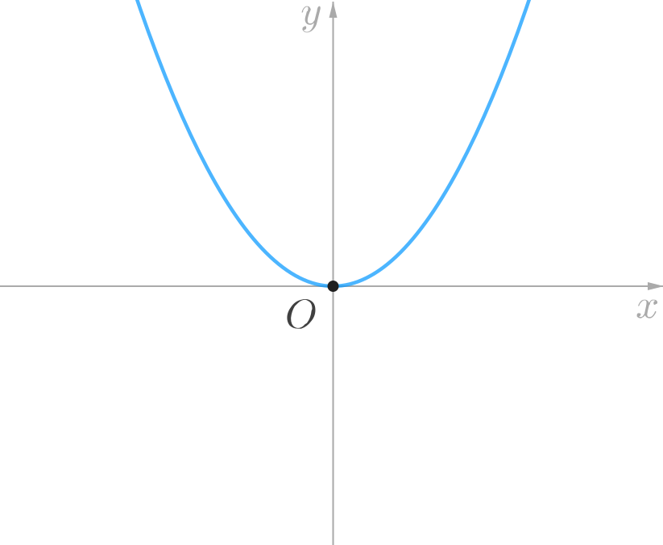

## Introduction

After the ellipse and hyperbola, we will now move on to the next **conic section**, namely the **parabola**.

The ellipse and hyperbola, both come in many different shapes. Two ellipses (or two hyperbolas) are *similar* to each other if and only if they have the same eccentricity.

Unlike the ellipse and the hyperbola, however, the circle and the parabola are both precise shapes. Just as every circle is similar to every other circle; every parabola is also similar to every other parabola.

As usual, rather than defining the parabola as a conic section, we will once again work with an alternative algebraic definition of the parabola so that we can investigate it in the framework of coordinate geometry.

## Standard Equations of the Parabola

The plane curve represented by each of the following Cartesian equations is a parabola.

$$
\begin{array}{ccc}
y^2 \, = \, 4ax, & &	y^2 \, = \, -4ax, \\[1ex]
x^2 \, = \, 4ay, & &	x^2 \, = \, -4ay.
\end{array}
$$

By convention, we will assume that $a$ is positive. We shall refer to these four equations as the **standard equations** of the parabola.

The parabola represented by the equation $y^2 = 4ax$ can be sketched on the Cartesian plane as follows:

The graph of $y^2 = -4ax$ is obtained by reflecting the above graph about the $y$-axis. Hence, it is a parabola that opens towards the left.

The parabola represented by the equation $x^2 = 4ay$ can be sketched on the Cartesian plane as follows:

The graph of $x^2 = -4ay$ is obtained by reflecting the above graph about the $x$-axis. Hence, it is a parabola that opens downwards.

<!-- When $a = b,$ then the hyperbola is said to be **equilateral**. We will revisit this in the last chapter. -->

In this book we will only investigate parabolas represented by the standard equations.

## Properties of the Parabola

A parabola has only one *axis of symmetry*, as shown in the below diagram. This line is called the **axis** of the parabola. The point, $O$ at which its axis intersects the parabola is called the **vertex** of the parabola.

<!-- In the following, we will refer to the parabola represented by the following standard equation.
$$
y^2 = 4ax
$$
where $a$ is positive. -->

1. If the parabola is represented by any one of the *standard equations*, then  the origin $\left(0, 0 \right)$ of the Cartesian plane coincides with the vertex of the parabola.

1. Given any parabola, there exists a unique straight line called the **directrix** and a unique point, $F$ (not on the straight line), called the **focus**, such that the distance from any point $P$ lying on the parabola to the point $F$ is equal to the perpendicular distance of $P$ from the straight line.

In terms of the above diagram, we can say that:
$$
\frac{PF}{PM} = 1
$$
Recall that the ratio of the distance of a point on the curve from the focus, to the perpendicular distance of the point from the directrix, was defined in earlier books as the **eccentricity** of the *ellipse* and the *hyperbola*. By analogy, we can say that according to the above definition, the eccentricity of a parabola is $1.$

1. The focus of a parabola always lies on its axis. And, the directrix of the parabola is always perpendicular to its axis. For a parabola represented by any of the standard equations, the focus and the directrix, both lie at a distance $a$ from the vertex of the parabola, but on opposite sides of the vertex. For instance, the focus and directrix of the parabola represented $y^2 = 4ax$ is shown in the following diagram.

The focus and directrix of the parabolas represented by the other standard equations can be similarly determined.

1. The line segment passing through the focus of the parabola and perpendicular to its axis, and whose end points lie on the parabola is called the **latus rectum** of the parabola.

In the above diagram, $AB$ is the latus rectum of the parabola. It can be proved that, if the distance between the vertex and focus of a parabola is $a,$ then the length $l,$ of the latus rectum of the parabola is $4a.$
$$
l = 4a
$$
It follows from the above that the end points of the latus rectum of the parabola $y^2 = 4ax$ are $(a, \pm 2a),$ and the end points of the latus rectum of the parabola $x^2 = 4ay$ are $(\pm 2a, a).$

---

*<u>Example 1:</u>*

Determine the coordinates of the focus, the equation of the directrix, and the length of the latus rectum of the parabola represented by the equation $x^2 - 12y = 0.$

<u>*Solution:*</u>

Let us first re-write the equation of the parabola in standard form:
$$
x^2 = 4(3)y
$$
This is of the form $x^2 = 4ay.$ Since the term on the RHS involves $y,$ and is positive, therefore, the axis of the parabola lies along the $y$-axis, and the parabola opens upwards. Moreover, here $a = 3.$

It follows that the focus lies on the positive $y$-axis at $(0, 3).$

The directrix is $y = -3.$

The length of the latus rectum is $l = 4a,$ that is $12.$

---

*<u>Example 2:</u>*

Determine the coordinates of the focus, the equation of the directrix, and the length of the latus rectum of the parabola represented by the equation $y^2 + x = 0.$

<u>*Solution:*</u>

Let us first re-write the equation of the parabola in standard form:
$$
y^2 = -4\left( \dfrac{1}{4} \right)x
$$
This is of the form $y^2 = -4ax.$ Since the term on the RHS involves $x,$ and is negative, therefore, the axis of the parabola lies along the $x$-axis, and the parabola opens leftwards. Moreover, here $a = \dfrac{1}{4}.$

It follows that the focus lies on the negative $x$-axis at $\left( -\dfrac{1}{4}, 0 \right).$

The directrix is $x = \dfrac{1}{4}.$

The length of the latus rectum is $l = 4a,$ that is $1.$

---

*<u>Example 3:</u>*

Suppose that a line segment $AB$ is the latus rectum of a parabola, where $A$ is located at $(2, -3),$ while $B$ is located at $(-2, -3).$ Given that the vertex of this parabola coincides with the origin, determine the equation of this parabola.

<u>*Solution:*</u>

From the given information, we can deduce the following points. The latus rectum $AB$ is such that,

* $AB$ is perpendicular to the $y$-axis
* the mid-point of $AB$ lies on the negative $y$-axis
* the length of $AB$ is $4$ units.

(sketch the points $A$ and $B$ if the above deductions are not obvious).

It follows that the corresponding parabola's axis is along the $y$-axis and it opens downwards. Hence the equation of the required parabola is of the form $x^2 = -4ay.$

But we know that the length of the latus rectum is $4.$ Hence, $4a = 4.$ Therefore, the equation of the required parabola is $x^2 = -4y.$

---

<!-- *<u>Example 2x:</u>*

Given that the distance between the foci of an ellipse is $6,$ and the distance between its directrices is $12,$ then determine the length of the latus rectum of the ellipse.

*<u>Solution:</u>*

Using the properties stated in point 7 above, we note that the distance between the foci of the ellipse is $2ae,$ and the distance between the directrices is $\dfrac{2a}{e}.$ Hence,
$$
2ae = 6 \ \text{ and } \ \dfrac{2a}{e} = 12
$$
Solving the above equations, we find that $a^2 = 18.$ We can now proceed as follows:
$$
\begin{align*}
b^2	&= a^2 - c^2 \\[1ex]
		&= a^2 - a^2e^2 \\[1ex]
		&= 18 - 9 \ = \ 9
\end{align*}
$$
Therefore, the length of the latus rectum is:
$$
l	\ = \ \frac{2b^2}{a} \ = \ \frac{18}{\sqrt{18}}
$$

--- -->

<!-- *<u>Example 2:</u>*

Given that the distance between the foci of a hyperbola is $2c,$ and the distance between its directrices is $2d,$ then determine the length of the latus rectum of the hyperbola.

*<u>Solution:</u>*

Using the properties stated in point 7 above, we note that the distance between the foci of the hyperbola is $2ae,$ and the distance between the directrices is $\dfrac{2a}{e}.$ Hence,
$$
2ae = 2c \ \text{ and } \ \dfrac{2a}{e} = 2d
$$
Solving the above equations, we find that $a^2 = c d.$ We can now proceed as follows:
$$
\begin{align*}
b^2	&= c^2 - a^2 \\[1ex]
		&= c^2 - cd
\end{align*}
$$
Therefore, the length of the latus rectum is:
$$
l	\ = \ \frac{2b^2}{a} \ = \ \frac{2\left( c^2 - cd \right)}{\sqrt{cd}}
$$

--- -->

## Tangent to the Parabola

**Tangent at the point $(x_0, y_0)$**

We can find the equation of the tangent to the parabola in the usual way, by first determining its slope as the derivative of $y$ at $(x_0, y_0),$ and then using the point-slope form of the equation of a line.

The result is easy to remember in the following form.

| Parabola	| Tangent	|
|			:----------:		|			:----------:		     |
| $y^2 = 4ax$	        | $y_0 y = 2a(x + x_0)$     |
| $y^2 = -4ax$	      | $y_0 y = -2a(x + x_0)$    |
| $x^2 = 4ay$	        | $x_0 x = 2a(y + y_0)$     |
| $x^2 = -4ay$	      | $x_0 x = -2a(y + y_0)$    |

In general, the equation of the tangent to a parabola, ellipse or hyperbola at the point $(x_0, y_0)$ can be obtained from the corresponding standard equation by replacing:

* any $x^2$ term by $x_0 x$
* any $y^2$ term by $y_0 y$
* any $2x$ term by $(x + x_0)$
* any $2y$ term by $(y + y_0)$

 **Condition for Tangency**

We can prove that a line $y = mx + c$ will be tangent to a parabola if the following condition is satisfied.

| Parabola	| Condition	|
|			:----------:		|			:----------:		|
| $y^2 = 4ax$	        | $c = \dfrac{a}{m}$      |
| $y^2 = -4ax$	      | $c = -\dfrac{a}{m}$     |
| $x^2 = 4ay$	        | $c = -am^2$             |
| $x^2 = -4ay$	      | $c = am^2$              |

 
<!-- Note that the variable $c$ used here is <u>not</u> related to the coordinates of the focus of the hyperbola. Instead, it represents the $y$ intercept of the line $y = mx + c.$ -->

<!-- Let there be given a parabola whose equation is,
$$
y^2 = 4ax
$$
then:

1. The equation of the tangent to this parabola at a point $P\, (x_0, y_0)$ lying on the parabola is,
$$
y_0 y = 2a\left(x + x_0 \right)
$$
(The conditions for parabolas represented by the other standard equations can be similarly determined.)

1. The condition for the line $y = mx + c$ to be tangent to this parabola is,
$$
c = \frac{a}{m}
$$
 -->

---

*<u>Example 4:</u>*

Determine the point at which the tangents to the parabola $x^2 - 8y = 0$ at the points $(-4, 2)$ and $\left(2 , \dfrac{1}{2}\right)$ intersect each other.

*<u>Solution:</u>*

The equation of the given parabola in standard form is,
$$
x^2 = 4(2)y
$$

The equation of the tangent to the parabola $x^2 = 4ax$ at the point $\left(x_0, y_0 \right)$ is,
$$
x_0 x = 2a(y + y_0)
$$

Hence, for the given parabola, the tangent at the point $(-4, 2)$ is $-4x = 4(y + 2).$ Which is the same as,
$$
x + y = -2
$$
And the tangent at the point $\left(2 , \dfrac{1}{2}\right)$ is $2x = 4\left( y + \dfrac{1}{2} \right).$ Which is the same as,
$$
x - 2y = 1
$$

Solving the simultaneous equations of the two tangents, we find that they intersect at the point $(-1, -1).$

---

## Practice Problems

1. Determine the coordinates of the focus, the equation of the directrix, and the length of the latus rectum of the parabola represented by each of the following equations:
    1.	$2y^2 - 3x  = 0$
    		yb-ans
    		Focus: $\left( \dfrac{3}{8}, 0 \right),$ directrix: $x = - \dfrac{3}{8},$ length of latus rectum: $\dfrac{3}{2}.$
         <u>*Hint:*</u> 
    		Convert the equation to standard form:
    		$$
    		y^2 = 4 \left( \frac{3}{8} \right)x
    		$$
    		Since the term on the RHS involves $x,$ and is positive, therefore the focus lies on the positive $x$-axis.
    		ye-ans
    1.	$y^2 + 20x  = 0$
    		yb-ans
    		Focus: $\left( -5, 0 \right),$ directrix: $x = 5,$ length of latus rectum: $20.$
         <u>*Hint:*</u> 
    		Convert the equation to standard form:
    		$$
    		y^2 = -4 \left( 5 \right)x
    		$$
    		Since the term on the RHS involves $x,$ and is negative, therefore the focus lies on the negative $x$-axis.
    		ye-ans
    1.  $y + 3x^2  = 0$
    		yb-ans
    		Focus: $\left( 0, -\dfrac{1}{12} \right),$ directrix: $y = \dfrac{1}{12},$ length of latus rectum: $\dfrac{1}{3}.$
         <u>*Hint:*</u> 
    		Convert the equation to standard form:
    		$$
    		x^2 = -4 \left( \frac{1}{12} \right)y
    		$$
    		Since the term on the RHS involves $y,$ and is negative, therefore the focus lies on the negative $y$-axis.
    		ye-ans
    1.  $3x^2 - 16y  = 0$
        yb-ans
        Focus: $\left( 0, \dfrac{4}{3} \right),$ directrix: $y = -\dfrac{4}{3},$ length of latus rectum: $\dfrac{16}{3}.$
         <u>*Hint:*</u> 
        Convert the equation to standard form:
        $$
        x^2 = 4 \left( \frac{4}{3} \right)y
        $$
        Since the term on the RHS involves $y,$ and is positive, therefore the focus lies on the positive $y$-axis.
        ye-ans

1. Suppose that $AB$ is the latus rectum of a parabola whose vertex coincides with the origin $O$ of the Cartesian plane, and whose focus lies on the positive $y$-axis. If the length of the segment $OA$ is $\sqrt{20}$ units, then determine the equation of the parabola.
	yb-ans
	$x^2 = 8y.$
	 <u>*Hint:*</u> 
	Since we know that the vertex of the parabola coincides with the origin $O$ and the focus $F$ lies on the positive $y$-axis, hence the equation of the parabola is of the form:
  $$
  x^2 = 4ay
  $$
  Observe that $OF = a,$ and $FA = 2a.$
  (This will be obvious if you sketch the said parabola.)
  Since we know that $AB = \sqrt{20},$ it follows from the right triangle $OFA,$ that,
  $$
  a^2 + (2a)^2 = \left( \sqrt{20} \right)^2
  $$
  Solve for $a.$
	ye-ans

1. The axis of a parabola lies along the $x$-axis and its vertex coincides with the origin. If one end point of the latus rectum is $(3, -6),$ and the point $(27, \beta)$ lies on this parabola, then determine the possible values of $\beta.$
	yb-ans
	$\pm 18.$
	 <u>*Hint:*</u> 
	The given parabola has the form $y^2 = 4ax.$ From the coordinates of the latus rectum, we can deduce that $a = 3.$ (This will be obvious if you sketch the said parabola.)
  We now know the equation of the parabola. Use it to deduce the value of $\beta.$
	ye-ans

1. Determine the equations of the two lines tangent to the parabola, $x^2 = -4y ,$ at the end points of its latus rectum.
	yb-ans
	$x + y = 1$ and $x - y = -1.$
	 <u>*Hint:*</u> 
	The given parabola opens downwards, therefore we can deduce (by sketching if necessary) that the end points of the latus rectum of the parabola will be $(\pm 2a, -a).$ For the parabola $x^2 = -4y,$ we have $a = 1.$
  Hence, we need to determine the equations of the tangents to the parabola at the points $(2, -1)$ and $(-2, -1).$
	ye-ans

1. If $y = mx + 6$ is tangent to both the parabolas, $y^2 = 12x$ and $x^2 = 2ky,$ then determine the value of $k.$
	yb-ans
	$k = -48.$
	 <u>*Hint:*</u> 
	Recall that the condition for $y = mx + c$ to be tangent to $y^2 = 4a_1 x$ is
	$$
	c = \frac{a_1}{m}
	$$
  For $y^2 = 12x,$ we have $a_1 = 3.$ So, in this case, we have,
  $$
  m = \dfrac{1}{2}
  $$
  Next, the condition for $y = mx + c$ to be tangent to $x^2 = 4a_2 y$ is
	$$
	c = -a_2 m^2
	$$
  Hence, $a_2 = \dfrac{-c}{m^2} = -24.$ But, for this problem, $4a_2 = 2k.$
	ye-ans
